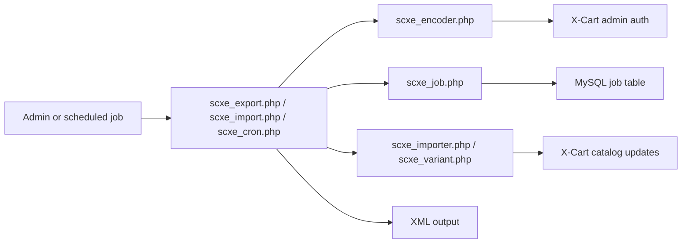

# X-Cart SellerCloud Sync Plugin

A legacy X-Cart 5 integration plugin that exposes XML-based import and export endpoints for catalog, pricing, inventory, shipping, and order data. The plugin authenticates an X-Cart admin session and uses a queue table plus cron entry points to process import jobs.

## Objective

This repository contains the historical code for a SellerCloud-to-X-Cart integration. It exports product, category, order, shipping and inventory information in XML format and can import product XML back into the X-Cart catalog.

The code is intentionally limited to the legacy platform integration pattern used by X-Cart 5:

- X-Cart request bootstrapping via `top.inc.php`
- XML response generation for export endpoints
- admin-auth validation through the X-Cart auth layer
- job record creation and retrieval in a queue table
- cron-triggered background processing for import tasks

What this project does not do:

- provide a modern REST API
- include a Dockerized local environment
- include modern CI pipelines or automated application tests
- rely on a modern package manager or framework structure

## Architecture

This is a legacy procedural PHP plugin with a thin object-oriented layer layered on top of X-Cart's runtime.

Main code paths:

- `src/scxe_export.php` — export endpoints for products, categories, orders, order status, shipping, and inventory
- `src/scxe_import.php` — install endpoint and import entry point
- `src/scxe_cron.php` — queue processing trigger
- `src/scxe/lib/class.scxe_job.php` — job table read/write helper
- `src/scxe/lib/class.scxe_encoder.php` — admin request validation and auth handling
- `src/scxe/lib/class.scxe_importer.php` — import logic for product updates
- `src/scxe/lib/class.scxe_export.php` — XML generation for export actions

## Coding style

- Language: PHP for a legacy X-Cart storefront integration
- Framework: X-Cart 5 runtime and database access model
- Style: procedural entry points with class-based helpers
- Execution model: request-driven scripts and cron-dispatched jobs
- Data access: direct SQL through X-Cart database connections and query builder calls
- Logging: basic XML and text logging under the `src/scxe/log/` area
- Error handling: direct exceptions and echoed XML responses, consistent with legacy plugin conventions

## Installation and deployment

This project was designed to be deployed by copying the plugin files into the target X-Cart store root and enabling the module endpoints.

1. Place the plugin files into the store's X-Cart installation so the `scxe` folder and root entry files are available in the storefront root.
2. Ensure the store can execute PHP files from the root and that the plugin folder structure is present.
3. Run the install entry point for the plugin in the X-Cart store.
4. Configure or verify the queue processing entry for the job runner.
5. Trigger export or import requests using the store's configured admin credentials.

## Legacy operational flow

This file documents the legacy X-Cart integration flow and has been redacted.

The original admin login, install code, local store URLs, and example credentials have been removed.

The plugin expects the following configuration in the target storefront environment:

- a valid X-Cart admin user
- the plugin's install endpoint
- a configured job queue
- XML requests authenticated by the store's own admin credentials

The operational flow is:

1. Install or enable the plugin in the X-Cart store.
2. Trigger the export or import endpoints with the store's configured admin session.
3. Process queued jobs through the background cron entry point.
4. Export XML product, category, shipping, and order data.

Example placeholders only:

- https://example.com/admin.php
- https://example.com/scxe_export.php?method=orders
- https://example.com/scxe_import.php?method=install
- https://example.com/files/scxe_log/placeholder-import.xml

No real credentials or production URLs are retained here.

## Configuration

The plugin reads runtime values directly from the request query string and the X-Cart storefront environment.

| Key | Purpose |
|---|---|
| `u` | admin username or login identifier |
| `p` | admin password or encrypted password payload |
| `method` | export or import action name |
| `id` | job identifier |
| `sku` | product SKU filter |
| `name` | product name filter |
| `from` / `to` | date filters for order export |
| `currentpageindex` | pagination index for product export |
| `rowsperpage` | page size for product export |

No live credentials are stored in this repository.

## Security and compliance notes

This project was written as a legacy integration and reflects older project practices. The code has been cleaned of real credentials and client-specific values, but some security properties remain legacy-only and should be treated as known limits rather than modern production controls.

This repository is aligned with GDPR principles and maps to ISO 27001-style control thinking in the sense of reducing exposure of credentials, limiting sensitive data in documentation, and avoiding plaintext secrets in the repository. It is not a formal certification claim.

## Design decisions

This repository does not currently contain formal ADRs. The code itself reflects a legacy X-Cart pattern:

- direct PHP entry points
- database-backed job queue
- XML payloads rather than API schemas
- admin-auth validation driven by the storefront runtime

## Known limits and next steps

- No automated tests exist in the repository.
- The plugin relies on query-string-based admin authentication patterns, which are not modern security practice.
- The job-processing logic is legacy and should be validated in a live X-Cart instance before production use.
- There is no formal API versioning, rate limiting, or health-check layer.
- The code is not structured as a modern application; it is a historical integration module.
- Any production deployment should move credentials to the store's own secure configuration model and validate access with current platform security controls.

## License and author

Author: Raman Basu
GitHub: https://github.com/ramanbasu-business

This repository is intended for portfolio and project review use and should be treated as a historical codebase unless separately approved for another licensing or publication model.
